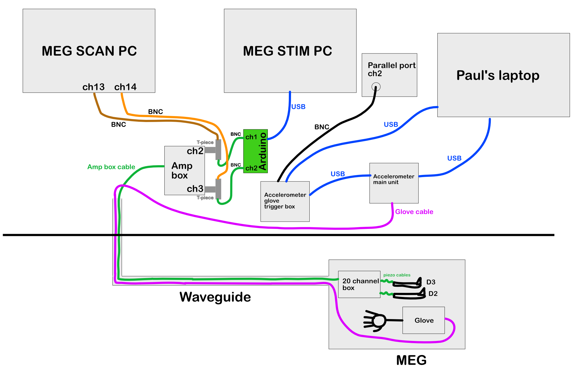

## MEG TOUCHMAP experimental SOP

### PART 1 - Kit
---
#### Somato
- Amplifier box
- 20-channel box
- 2x piezo connector leads
- 2x piezo stimulators
- Mini somato MEG arduino
- 4x BNC cables. 2 to plug into the arduino, 2 to connect to the MEG SCAN PC
- 1x arduino-USB cable
- 2x BNC T-pieces

#### Motor
- Accelerometer glove
- Accelerometer main unit.
- 1x BNC cable, plugs into channel (2) on parallel port
- Accelerometer glove trigger box
- 1x Optical cable
- 2x USB cables. 1 to power the glove trigger box, 1 to connect from accelerometer main unit to laptop.
- Paul Glover's laptop (NIDAQ card required)
- Gloves with velcro attachments

#### Code
- All somato and motor code should be present on MEG STIM PC, if not, downloadable from Github: [https://github.com/nottingham-neuroimaging/TouchmapStimMEG](https://github.com/nottingham-neuroimaging/TouchmapStimMEG)
- The MEG STIM PC code is located in the D: drive, under **MEGuser/Documents/George/Touchmap**
- Accelerometer code should be present on Paul's laptop. This will be under **Public Documents/DigitMonitor**
- If not, you can download it from Github: [https://github.com/nottingham-neuroimaging/nottingham](https://github.com/nottingham-neuroimaging/nottingham). It is in **nottingham/accelerometer**
- The arduino will need to be flashed during the experiment as Somato task 1 and 2 require different arduino software installed. These are present on the MEG STIM PC in **MEGuser/Documents/George/Touchmap/arduino_firmware**.
- Double click (needs arduino IDE installed: [https://www.arduino.cc/en/software](https://www.arduino.cc/en/software)) and first click **VERIFY** (tick) and then **UPLOAD** (left-to-right arrow).

### PART 2 - Setting up
---
#### Somato hardware
1. Connect amp box to power. Do not switch on.
2. Send 20-ch box cable through waveguide, connect to amp box in control room.
3. Connect BNC cables to T-pieces, connect these to the MEG PC. Connect T-pieces to amp box in channels 2 and 3. Maintain numerical consistency, i.e. channel 1 from MEG PC to channel 2 on amp box / channel 2 from MEG SCAN PC to channel 3 on amp box.
4. Connect channel 2 BNC cable (which is connected to amp box via T-piece) to channel 1 on Mini somato MEG arduino. Connect channel 3 BNC cable (which is connected to amp box via T-piece) to channel 2 on Mini somato MEG arduino.
5. Connect USB-arduino cable from arduino to MEG STIM PC.

#### Somato software
1. First test triggers by running `touchmap_00_triggertest.m`
2. Somato task 1 is `touchmap_03_sensory.m`. This requires the **miniSomatoMEG** arduino firmware to be flashed.
3. Somato task 2 is `touchmap_04_td.m`. This requires the **TemporalDiscrimination** arduino firmware to be flashed.

#### Motor hardware
1. Pass accelerometer glove cable through waveguide. Connect to accelerometer main unit in control room.
2. Connect USB cable from main unit to Paul's laptop.
3. Connect USB cable from glove trigger box to power source (can be laptop).
4. Connect optical cable from glove trigger box to main unit (should click in, if not, try rotating 180 and reinserting).
5. Connect BNC cable from glove trigger box to channel (2) on parallel port, which is connected to MEG STIM PC.
6. Connect all 5 accelerometers to each digit on the velcro glove.

#### Motor software
1. Run the `DigitMonitor.m` code, which will bring up the GUI. 
2. First, press **save file**, note down the name of the file and save location. When you are ready to run the experiment, press **START**. The glove's movements are now being recorded. When finished, press **STOP**. Make sure the saved file is not 0 kb, otherwise it hasn't saved.
3. To make extra sure, run the `DigitReviewer.m` if you have time, just to see if the file has triggers/each of the accelerometer timepoints. Each accelerometer has 3 axes, so 15 channels and 16th channel is the trigger.
4. To run the finger abduction task, run `touchmap_02_motor.m`.
5. In terms of ordering, first set MEG SCAN up, start the accelerometer software, then run the finger abduction task code. 

### PART 3 - Packdown
---
1. Make sure the accelerometer data (**.dat** file) is saved somewhere, ideally an external USB stick. Shutdown Paul's laptop and disconnect all cables.
2. Switch the power off to the amplifier box. Disconnect all cables, option to keep T-pieces connected to amp box for next time. 
3. Pass cables back through waveguide. 
4. Place accelerometer cables and kit into one box, and the somato kit into another box. 
5. To comply with COVID-19 restrictions make sure you wipe down all kit with anti-bacterial/viral wipes. Additionally, one can use disposable gloves inside the accelerometer glove for each participant.

### PART 4 - Connection diagram
---

